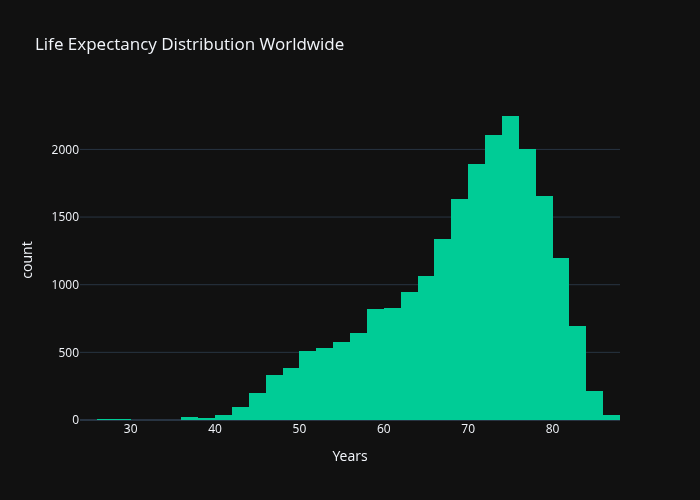
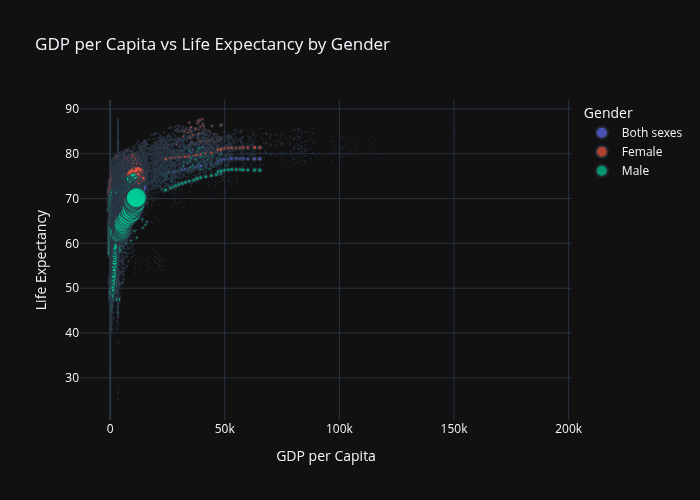
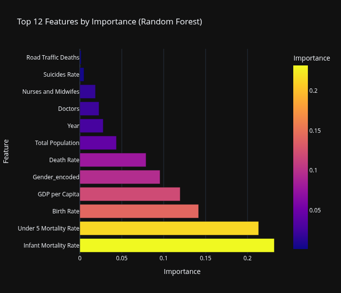

# 30 Days of Datasets

A personal challenge to explore and analyze a different dataset every day for 30 days.

## Overview

This project focuses on building practical data analysis skills through hands-on exploration of diverse datasets. Each day includes data cleaning, exploratory data analysis, visualization, and insights extraction.

## Visual Highlights

Here are some visualizations from the final day (Day 30 - Global Health Analysis):

### Global Life Expectancy Distribution

### Economic Impact on Health (GDP vs Life Expectancy)

### Model Feature Importance

## Daily Projects

- [Day 1: Hospital Operations Analysis](./day1/)
- [Day 2: Earthquake & Tsunami Risk Assessment](./day2/)
- [Day 3: Health and Lifestyle Recommendation System](./day3/)
- [Day 4: Netflix EDA - Content Strategy Analysis](./day4/)
- [Day 5: Fruit Classification - ML Classification Models](./day5/)
- [Day 6: Student Data Analysis & Multi‑Output Score Predictor](./day6/)
- [Day 7: Decoding Medical Costs: Analyzing Insurance Data](./day7/)
- [Day 8: Energy Consumption & Cost Prediction](./day8/)
- [Day 9: BMW Sales Data Analysis & Price Prediction](./day9/)
- [Day 10: Goodreads Books Analysis](./day10/)
- [Day 11: Housing Price Analysis & Prediction](./day11/)
- [Day 12: Heart Disease Prediction](./day12/)
- [Day 13: Car Price Prediction 2025](./day13/)
- [Day 14: Global Mobile Prices Analysis](./day14/)
- [Day 15: Loan Eligibility Prediction](./day15/)
- [Day 16 & 17: Ensemble-Powered Loan Payback Prediction](./day16&17/)
- [Day 18: SMS Spam Filter](./day18/)
- [Day 19: Student Performance Factors Analysis](./day19/)
- [Day 20: GPU Evolution Analysis](./day20/)
- [Day 21: UK Job Market Analysis 2025](./day21/)
- [Day 22: Iris Flower Classification](./day22/)
- [Day 23: Spotify Track Data Analysis](./day23/)
- [Day 24: Patient Health Dataset EDA and ML](./day24/)
- [Day 25: Diamonds Dataset EDA with Plotly and ML](./day25/)
- [Day 26: Global Air Quality Dataset EDA with Plotly and ML](./day26/)
- [Day 27: F1 Race Results Dataset EDA with Plotly and ML](./day27/)
- [Day 28: Global Gender Inequality Index EDA with Plotly and ML](./day28/)
- [Day 29: Mental Health Social Media Analysis](./day29/)
- [Day 30: Global Health Dataset - Comprehensive EDA & Ensemble ML](./day30/)

## Project Details

### Day 1: Hospital Operations Analysis
**Dataset**: [Hospital Beds Management](https://www.kaggle.com/datasets/jaderz/hospital-beds-management)  
**Summary**: Analyzed hospital operations data including patient satisfaction, staff performance, and resource utilization across departments.  
**Key Findings**: Surgery department highest satisfaction (80.3%), event management stronger impact on morale than workload, bed shortage during mid-year, winter surge capacity issues.

### Day 2: Earthquake & Tsunami Risk Assessment
**Dataset**: [Global Earthquake Tsunami Risk](https://www.kaggle.com/datasets/ahmeduzaki/global-earthquake-tsunami-risk-assessment-dataset/data)  
**Summary**: Built Random Forest classifier to predict tsunami occurrence from seismic data, achieving 80-90% accuracy.  
**Key Findings**: Shallow earthquakes with high magnitude pose greatest risk, temporal trends show increasing probability, proximity and intensity strong indicators.

### Day 3: Health and Lifestyle Recommendation System
**Dataset**: [Life Style Data](https://www.kaggle.com/datasets/jockeroika/life-style-data?select=Final_data.csv)  
**Summary**: Dual recommendation system with rule-based and ML components for health advice based on BMI, exercise, hydration.  
**Key Findings**: BMI and fat percentage strongest predictors, workout frequency and hydration actionable areas, ML model highlights numeric feature contributions.

### Day 4: Netflix EDA - Content Strategy Analysis
**Dataset**: [Netflix Movies and TV Shows](https://www.kaggle.com/datasets/hqdataprofiler/cleaned-netflix-movies-and-tv-shows)  
**Summary**: Comprehensive EDA of Netflix content library with unique insights beyond typical analysis.  
**Key Findings**: Concise titles (30-40 characters), mature content longer descriptions, strategic director partnerships, global production expansion (US, India, UK).

### Day 5: Fruit Classification - ML Classification Models
**Dataset**: [Fruit Classification](https://www.kaggle.com/datasets/pranavkapratwar/fruit-classification)  
**Summary**: Analyzed fruit dataset with 10,000 samples and built Random Forest classifier for fruit type prediction.  
**Key Findings**: Physical attributes (weight, size) strong predictors, consistent model accuracy, interpretable feature importance.

### Day 6: Student Data Analysis & Multi‑Output Score Predictor
**Dataset**: [Students Academic Performance](https://www.kaggle.com/datasets/sadiajavedd/students-academic-performance-dataset)  
**Summary**: Multi-output regression to predict Math, Reading, Writing scores from demographic features.  
**Key Findings**: Test preparation correlates with higher scores, gender differences in subjects, initial model performance low (R² ~0.15), needs feature engineering.

### Day 7: Decoding Medical Costs: Analyzing Insurance Data
**Dataset**: [Medical Cost Personal Datasets](https://www.kaggle.com/datasets/saadaliyaseen/decoding-medical-costs-analyzing-insurance-data)  
**Summary**: Decision Tree regression to predict insurance charges from demographic and health features.  
**Key Findings**: R² score 0.85, MAE ~2994, smoking status and BMI key predictors, regional variations in costs.

### Day 8: Energy Consumption & Cost Prediction
**Dataset**: [Residential and Commercial Energy Cost](https://www.kaggle.com/datasets/andreylss/residential-and-commercial-energy-cost-dataset)  
**Summary**: Decision Tree regressor for energy cost prediction achieving R² 0.87.  
**Key Findings**: Building size and occupants strongest predictors, cost range BRL 52-154, regional consumption patterns, AC premium.

### Day 9: BMW Sales Data Analysis & Price Prediction
**Dataset**: [BMW Sales Data (2010-2024)](https://www.kaggle.com/datasets/ahmadrazakashif/bmw-worldwide-sales-records-20101024)  
**Summary**: AdaBoost regressor for BMW price prediction with comprehensive sales trend analysis.  
**Key Findings**: Petrol dominance, top models (5/3/X3 Series), automatic transmission preference, regional fuel preferences, strong predictive performance.

### Day 10: Goodreads Books Analysis
**Dataset**: [Goodreads Books Dataset](https://www.kaggle.com/datasets/kutayahin/goodreads-books-dataset)  
**Summary**: AdaBoost regressor for book rating prediction based on title and author characteristics.  
**Key Findings**: Title complexity influences ratings, series books distinct patterns, author information predictive, strong model performance.

### Day 11: Housing Price Analysis & Prediction
**Dataset**: [Real Estate Price Insights](https://www.kaggle.com/datasets/wardabilal/real-estate-price-insights)  
**Summary**: AdaBoost regressor for housing price prediction with market driver analysis.  
**Key Findings**: Area strongest predictor, AC adds 50% premium, furnishing status impacts 30-40%, parking availability significant.

### Day 12: Heart Disease Prediction
**Dataset**: [Heart Failure Dataset](https://www.kaggle.com/datasets/tan5577/heart-failure-dataset)  
**Summary**: Logistic regression for heart disease classification with EDA dashboard.  
**Key Findings**: Age, cholesterol, blood pressure key factors, confusion matrix evaluation, prediction function for single patients.

### Day 13: Car Price Prediction 2025
**Dataset**: [Car Price Prediction](https://www.kaggle.com/datasets/aliiihussain/car-price-prediction)  
**Summary**: XGBoost regressor outperforming other models for car price prediction.  
**Key Findings**: Car age and mileage per year strong predictors, luxury brands premium, electric/hybrid trends, R² 0.90+ performance.

### Day 14: Global Mobile Prices Analysis and Trend Forecasting
**Dataset**: [World Smartphone Market 2025](https://www.kaggle.com/datasets/shahzadi786/world-smartphone-market-2025)  
**Summary**: Exploratory analysis of global mobile phone listings using Plotly. Attempted short-term trend forecasting on annual median prices when multi-year data is available. Produced a conservative supervised baseline pipeline and saved trend artifacts for reproducibility.
**Key Findings**: Price distribution is right-skewed, specification clusters at common values, cross-sectional correlations with price are weak, annual median price provides a stable short-term signal when available.

### Day 15: Loan Eligibility Prediction
**Dataset**: Loan eligibility CSV (`data/Loan_Eligibility_Prediction.csv`)  
**Summary**: Classification pipeline to predict loan approval. Includes encoding, feature engineering, model comparison (Logistic Regression, Decision Tree, Random Forest), and a final selected model exported for reuse.
**Key Findings**: Approval strongly linked to credit history and verified income; married and semiurban applicants show higher approval rates in this dataset.

### Day 16 & 17: Ensemble-Powered Loan Payback Prediction
**Dataset**: [Playground Series S5E11](https://www.kaggle.com/competitions/playground-series-s5e11)  
**Summary**: Ensemble classification for loan payback prediction using CatBoost, LightGBM, and XGBoost with cross-validation. Includes preprocessing, model comparison, and additional visualizations for insights.
**Key Findings**: CatBoost and LightGBM top performers; ensemble improves robustness; education level and grade are key predictors.

### Day 18: SMS Spam Filter
**Dataset**: [SMS Spam Collection Dataset](https://www.kaggle.com/datasets/uciml/sms-spam-collection-dataset)  
**Summary**: Naive Bayes classifier with TF-IDF for SMS spam detection. Includes visualizations of text distributions and model evaluation.
**Key Findings**: Effective spam classification; text length patterns differ by label; potential for improvement with larger, diverse text datasets.

### Day 19: Student Performance Factors Analysis
**Dataset**: [Students Performance Dataset](https://www.kaggle.com/datasets/rabieelkharoua/students-performance-dataset)  
**Summary**: Exploratory data analysis of student performance factors using Plotly and Seaborn visualizations.  
**Key Findings**: Attendance and hours studied strongest predictors of exam scores, parental education shows positive association, gender differences minimal.

### Day 20: GPU Evolution Analysis
**Dataset**: [GPU Data](https://www.kaggle.com/datasets/alanjo/gpu-data)  
**Summary**: Analysis of GPU specifications evolution from 1986-2026 with temporal trends and lightweight ML prediction.  
**Key Findings**: Exponential memory growth, NVIDIA dominance, linear regression challenges with technological progress.

### Day 21: UK Job Market Analysis 2025
**Dataset**: [Jobs 2025 Dataset](https://www.kaggle.com/datasets/jakupymeraj/jobs-a-2025-dataset)  
**Summary**: EDA of UK job postings with salary analysis and Random Forest prediction model.  
**Key Findings**: Teaching/healthcare jobs dominant, energy/legal highest salaries, predictive model for salary estimation.

### Day 22: Iris Flower Classification
**Dataset**: [Iris Flowers Dataset](https://www.kaggle.com/datasets/nalisha/machine-learning-practice-dataset-iris-flowers)  
**Summary**: EDA and Random Forest classification of Iris species based on flower measurements.  
**Key Findings**: Petal dimensions key differentiators, high model accuracy, clear species separation.

### Day 23: Spotify Track Data Analysis
**Dataset**: Spotify track datasets (track_data_final.csv and spotify_data_clean.csv)  
**Summary**: Extensive EDA on Spotify track data including popularity, artist metrics, and genres, followed by classification models to predict track popularity categories.  
**Key Findings**: Track popularity correlates with artist popularity and followers, explicit content analysis, genre distributions, classification models achieving reasonable accuracy.

### Day 24: Patient Health Dataset EDA and ML
**Dataset**: Processed patient health dataset with metabolic syndrome indicators  
**Summary**: Comprehensive EDA and Random Forest classification to predict metabolic syndrome risk from health metrics.  
**Key Findings**: Obesity percentage strongest predictor, 100% model accuracy, metabolic risk factors key indicators, effective patient risk stratification.

### Day 25: Diamonds Dataset EDA with Plotly and ML
**Dataset**: Diamonds dataset with physical attributes and pricing  
**Summary**: Interactive EDA using Plotly and Random Forest regression for diamond price prediction.  
**Key Findings**: Carat weight dominant predictor, 98.1% R² score, excellent price prediction accuracy, pipeline for easy deployment.

### Day 26: Global Air Quality Dataset EDA with Plotly and ML
**Dataset**: Global air quality dataset with AQI values and pollutant measurements  
**Summary**: Interactive EDA using Plotly and Random Forest regression for AQI prediction.  
**Key Findings**: PM2.5 dominant pollutant, 99.95% R² score, excellent AQI prediction accuracy, pipeline for air quality monitoring.

### Day 27: F1 Race Results Dataset EDA with Plotly and ML
**Dataset**: Formula 1 race results dataset with driver, constructor, and race information  
**Summary**: Interactive EDA using Plotly and Random Forest regression for final race position prediction.  
**Key Findings**: Grid position strongest predictor, 63.5% R² score, constructor and driver performance key factors, pipeline for race outcome prediction.

### Day 28: Global Gender Inequality Index EDA with Plotly and ML
**Dataset**: Global Gender Inequality Index (GII) dataset from UNDP with 241 countries and regions  
**Summary**: Interactive dark-themed EDA using Plotly and Random Forest regression for inequality prediction.  
**Key Findings**: Geographic clustering evident, 82.3% R² score, strong development-inequality link, Nordic countries most equal, regional patterns captured effectively.

### Day 29: Mental Health Social Media Analysis
**Dataset**: Mental Health Social Media Dataset with 5,000 records  
**Summary**: Comprehensive EDA and Random Forest classification to predict mental health states from social media usage patterns.  
**Key Findings**: Screen time correlates with mental health states, 100% model accuracy, anxiety and age show notable relationships, pipeline for mental health risk assessment.

### Day 30: Global Health Dataset - Comprehensive EDA & Ensemble ML
**Dataset**: Unified Global Health Dataset with 22,050 records across 195 countries (1990-2021)  
**Summary**: Maximum extensive EDA using Plotly (9 interactive visualizations) and powerful ensemble voting classifier combining Random Forest, Gradient Boosting, Logistic Regression, and KNN models for life expectancy prediction.  
**Key Findings**: Infant and child mortality rates strongest predictors (45% combined importance), GDP per capita significantly influences health outcomes, voting ensemble achieves 89.93% accuracy, global life expectancy increased from ~65 to ~72 years over 30 years, production-ready pipeline for health outcome predictions.

## Goals

- Practice data cleaning and preparation techniques
- Develop proficiency in exploratory data analysis
- Create meaningful visualizations
- Extract actionable insights from data
- Build a portfolio of data analysis work

## Tools Used

- Python (pandas, plotly, numpy)
- Jupyter Notebooks
- Scikit-learn (ML pipelines and ensemble methods)

## Progress

Current Day: 30/30 ✅ **CHALLENGE COMPLETED!**
