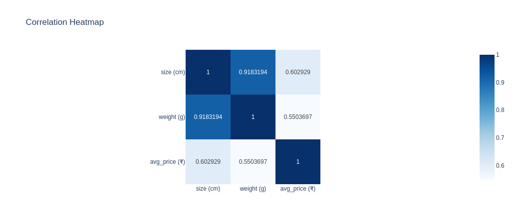

# Day 5: Fruit Classification - ML Classification Models

## Dataset

Fruit Classification Dataset
Source: [Kaggle](https://www.kaggle.com/datasets/pranavkapratwar/fruit-classification)

## Summary

The dataset contains 10,000 samples of different fruits with seven features: size, shape, weight, average price, color, taste, and fruit name. The goal was to analyze the dataset and build a classification model to predict the fruit type based on its characteristics.

Exploratory analysis was done using Plotly to visualize feature distributions, correlations, and relationships between size, weight, and price. Interactive plots provided insight into how fruit types vary across these attributes.

_Correlation between numerical features_

Categorical features were encoded and the data was split into training and testing sets. A Random Forest classifier was trained to classify fruit names based on the available features. Model performance was evaluated using a classification report and a confusion matrix. Feature importance was plotted to identify which attributes contributed most to the classification results.

The Random Forest model achieved consistent accuracy and provided interpretable results, showing that physical attributes such as weight and size were strong predictors of fruit type.

