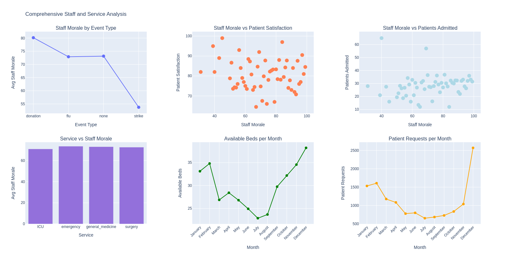

# Day 1: Hospital Operations Analysis

## Dataset

[Dataset Link - https://www.kaggle.com/datasets/jaderz/hospital-beds-management]

## Summary

Analyzed a year's worth of hospital operations data including patient satisfaction, staff performance, and resource utilization across four departments (ICU, Emergency, General Medicine, Surgery).

## Key Analyses

**Patient Satisfaction**
- Tracked satisfaction trends over time
- Identified seasonal peaks in October/November
- Analyzed relationship between length of stay and satisfaction by department

**Service Quality**
- Surgery department showed highest satisfaction (80.3) with longest stays (8.5 days)
- Emergency handled highest volume (263 patients) with efficient 4-day average stays
- General Medicine showed opportunity for improvement (78.6 satisfaction)

**Staff Performance**
- Examined correlation between staff morale and patient satisfaction (0.145)
- Analyzed impact of events (strikes, donations, flu outbreaks) on morale
- Identified consistent morale levels across all departments

**Resource Management**
- Discovered critical bed shortage during mid-year (June-September)
- Found 3x increase in patient requests during winter months (December peak: 2,600)
- Identified capacity mismatch: adequate summer beds with low demand, insufficient winter beds with high demand

## Insights

1. Event management has stronger impact on morale than workload
2. Bed capacity expansion needed before winter surge (September-November)
3. Specialized care departments (Surgery, ICU) correlate with higher satisfaction
4. Summer-winter resource reallocation could improve capacity utilization

## Visualizations

- Patient satisfaction histogram over time
- Service quality bubble chart (satisfaction vs time spent vs volume)
- Staff morale analysis across events and services
- Monthly bed availability and patient demand trends
- Staff attendance patterns

*Figure: Group of visualizations or Services and Morale analysis at the hospital*

## Files

- `notebooks/eda.ipynb` - Complete exploratory data analysis
- `data/raw/` - Original datasets
- `data/cleaned/` - Processed and feature-engineered datasets
