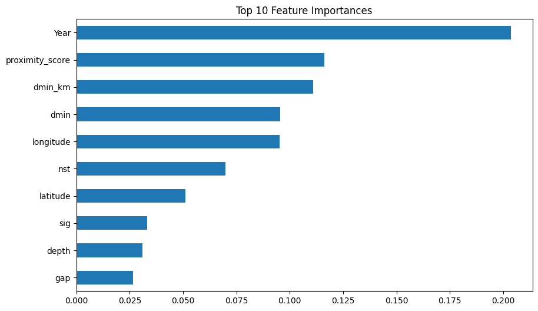

# Day 2: Earthquake & Tsunami Risk Assessment

## Dataset

https://www.kaggle.com/datasets/ahmeduzaki/global-earthquake-tsunami-risk-assessment-dataset/data

## Summary

Built a machine learning model to predict tsunami occurrence based on earthquake characteristics. The Random Forest classifier achieved 80-90% accuracy in identifying tsunami risk from seismic data.

## Objective

Predict whether an earthquake will trigger a tsunami based on seismic features including magnitude, depth, location, and intensity measurements.

## Feature Engineering

Created additional features to improve model performance:
- **Energy**: Magnitude squared to represent seismic energy release
- **Felt vs Measured**: Difference between MMI and CDI intensity scales
- **Distance Metrics**: Converted dmin to kilometers and created proximity score
- **Gap Normalization**: Standardized azimuthal gap to 0-1 scale
- **Depth Categories**: Classified earthquakes as shallow (0-70km), intermediate (70-300km), or deep (300-700km)
- **Seasonal Patterns**: Encoded month into seasonal categories

*Figure: Top 10 tsunami contributors.*

## Model Performance

**Random Forest Classifier**
- Training samples: 80% of dataset
- Test samples: 20% of dataset
- Number of estimators: 300
- Accuracy: 80-90%

The model successfully identifies patterns between earthquake characteristics and tsunami occurrence, with feature importance analysis revealing key predictive factors.

## Key Findings

**Most Important Features**
1. Year of occurrence (indicating climate change impact)
2. Magnitude and derived energy
3. Depth and proximity metrics
4. Geographic coordinates
5. Intensity measurements (MMI, CDI)

**Model Insights**
- Temporal trends show increasing tsunami probability over time
- Shallow earthquakes with high magnitude pose greatest tsunami risk
- Proximity to epicenter and seismic intensity are strong indicators

## Technical Details

**Preprocessing**
- Standard scaling applied to numerical features
- One-hot encoding for categorical variables (depth category, season)
- Train-test split with random state for reproducibility

**Evaluation**
- Classification report with precision, recall, F1-score
- Confusion matrix visualization
- Feature importance ranking

## Model Testing

Included prediction example for hypothetical earthquake:
- Magnitude 7.2
- Shallow depth (50km)
- High seismic signature
- Model successfully classifies tsunami risk

## Files

- `notebooks/ml.ipynb` - Complete machine learning pipeline
- `data/earthquake_data_tsunami.csv` - Earthquake and tsunami dataset

## Tools Used

- Python (pandas, numpy, scikit-learn)
- Random Forest Classifier
- Seaborn and Matplotlib for visualization
- StandardScaler for feature normalization