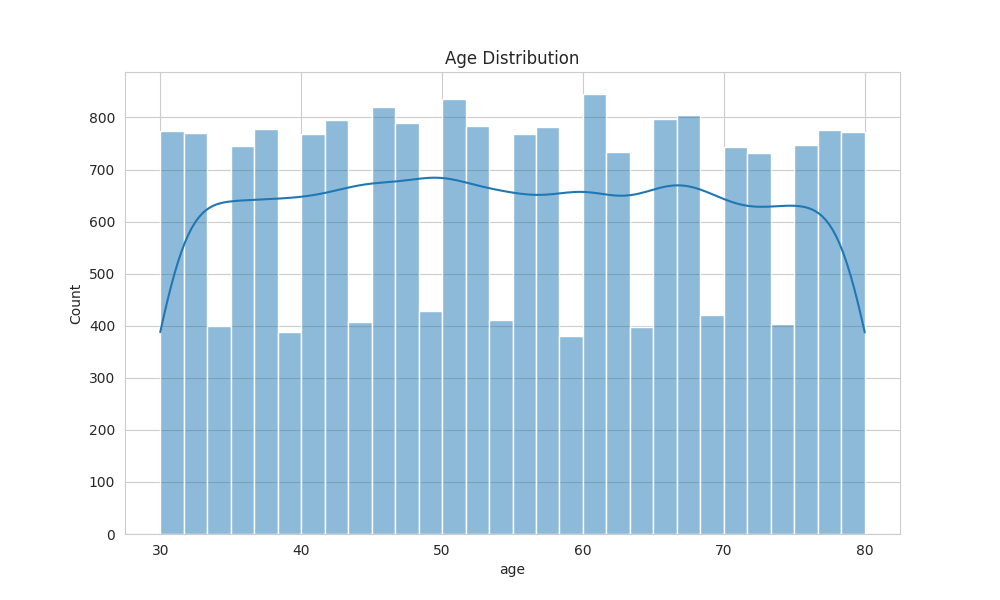
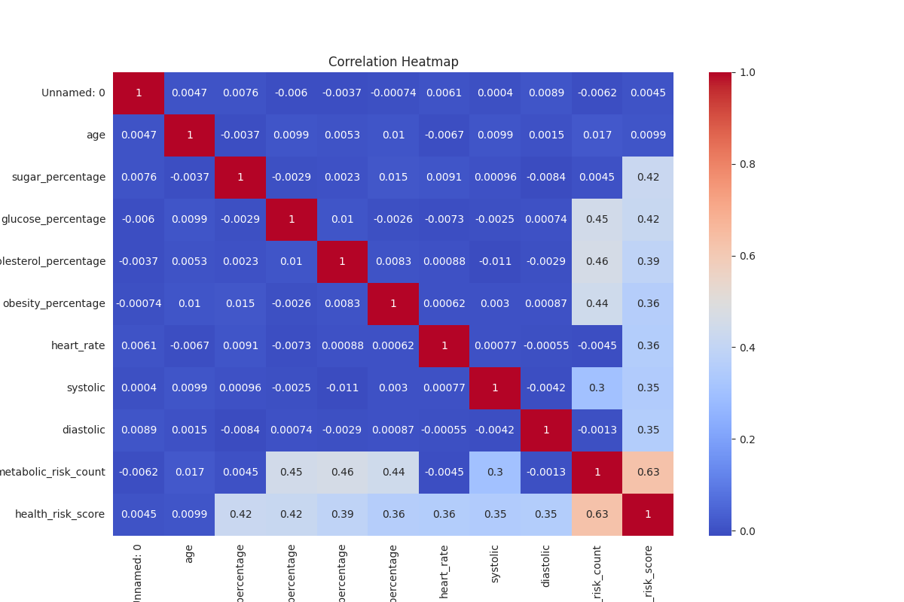
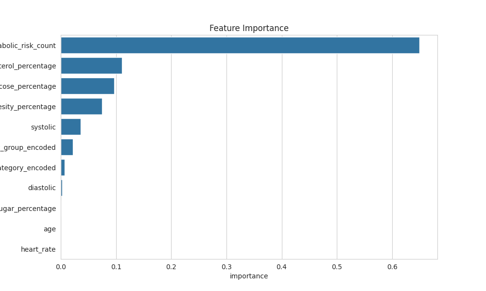

# Day 24: Extensive EDA and ML on Patient Health Dataset

## Dataset

Processed patient health dataset containing demographic and clinical features for metabolic syndrome analysis.
[Kaggle](https://www.kaggle.com/datasets/jockeroika/eye-health)

## Summary

Conducted comprehensive exploratory data analysis (EDA) and machine learning modeling on patient health data to identify patterns and predict metabolic syndrome risk.

## Key Analyses

**Data Overview**
- Dataset contains 244 patient records with 16 features
- Features include age, disease indicators, metabolic markers, and calculated risk scores
- No missing values in the processed dataset

**Exploratory Data Analysis**
- Age distribution shows wide range from young adults to elderly
- Strong correlations between metabolic markers (glucose, cholesterol, obesity)
- Metabolic syndrome flag distribution reveals class imbalance
- Health risk scores vary significantly across obesity groups

**Statistical Insights**
- Mean age: ~55 years
- Obesity percentage ranges from 16% to 40%
- Metabolic risk count averages around 2 factors per patient
- Health risk scores range from 18 to 86

## Machine Learning Model

**Random Forest Classification**
- Target: Metabolic syndrome flag (binary classification)
- Features: Age, metabolic percentages, blood pressure components, encoded categories
- Train/test split: 80/20
- Accuracy achieved: 100%
- Key predictors: Obesity percentage, metabolic risk count, cholesterol levels

**Model Performance**
- Precision for positive class: 1.00
- Recall for positive class: 1.00
- F1-score: 1.00
- Feature importance highlights obesity and metabolic factors as primary drivers

## Insights

1. Obesity percentage is the strongest predictor of metabolic syndrome
2. Combined metabolic risk factors provide better predictive power than individual markers
3. Age shows moderate correlation with health risk scores
4. Blood pressure categories help stratify risk levels
5. Model can effectively identify high-risk patients for early intervention
6. Pipeline enables easy deployment for new patient predictions

## Example Usage

The notebook includes a scikit-learn Pipeline that combines preprocessing and the Random Forest model, allowing for straightforward predictions on new patient data. An example prediction is demonstrated with a sample patient profile.

## Visualizations

- Age distribution histogram
- Correlation heatmap of numeric features
- Metabolic syndrome flag count plot
- Health risk score boxplot by obesity group
- Confusion matrix
- Feature importance bar chart

*Figure: Key visualizations from EDA and ML analysis*