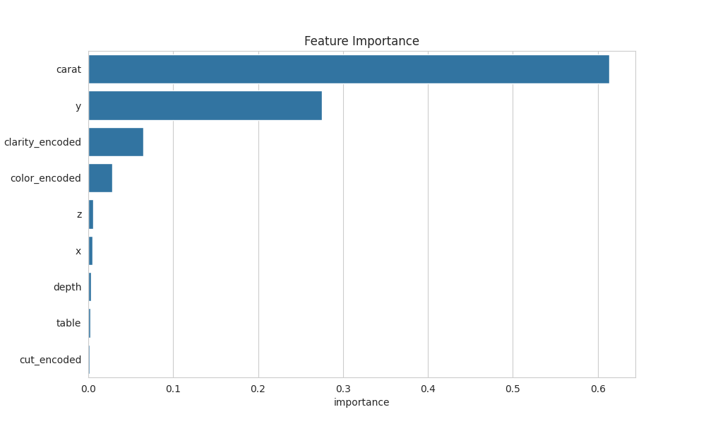

# Day 25: Extensive EDA with Plotly and ML on Diamonds Dataset

## Dataset

Diamonds dataset containing physical attributes and price information for diamond gemstones.
[Kaggle](https://www.kaggle.com/datasets/ayeshaseherr/diamonds)

## Summary

Conducted comprehensive exploratory data analysis using Matplotlib and Seaborn for visualizations and built a Random Forest regression model to predict diamond prices based on carat, cut, color, clarity, and other features.

## Key Analyses

**Data Overview**
- Dataset contains 53,940 diamond records with 10 features
- Features include carat weight, cut quality, color grade, clarity, dimensions, and price
- No missing values in the dataset

**Exploratory Data Analysis**
- Price distribution shows right-skewed pattern with most diamonds under $5,000
- Strong positive correlation between carat weight and price
- Cut quality affects price distribution, with Premium and Ideal cuts being most common
- Color grades show clear price stratification, with D (best) being most expensive
- Clarity levels demonstrate varying price ranges

**Statistical Insights**
- Average price: ~$3,933
- Average carat: 0.80
- Price range: $326 to $18,823
- Dimensions (x, y, z) strongly correlate with carat and price

## Machine Learning Model

**Random Forest Regression**
- Target: Diamond price (continuous)
- Features: Carat, depth, table, dimensions, encoded categorical variables
- Train/test split: 80/20
- Performance metrics:
  - MAE: ~$274
  - RMSE: ~$547
  - R²: 0.981

**Model Performance**
- Excellent predictive accuracy with 98.1% variance explained
- Carat weight is the dominant predictor (importance: ~0.85)
- Categorical features (cut, color, clarity) provide additional predictive power
- Model effectively captures non-linear relationships in diamond pricing

## Insights

1. Carat weight is the strongest determinant of diamond price
2. Physical dimensions (x, y, z) are highly correlated with carat and price
3. Color and clarity grades create distinct price tiers
4. Cut quality has moderate impact on pricing
5. Model can accurately predict diamond prices for valuation purposes
6. Pipeline enables easy deployment for new diamond price predictions

## Example Usage

The notebook includes a scikit-learn Pipeline that combines preprocessing and the Random Forest model, allowing for straightforward price predictions on new diamond data. An example prediction is demonstrated with a sample diamond profile.

## Visualizations

- Price distribution histogram (interactive)
- Carat vs Price scatter plot by cut quality
- Correlation heatmap of numeric features
- Cut distribution pie chart
- Price by color box plot
- Price distribution by clarity violin plot
- Actual vs Predicted price scatter plot
- Feature importance bar chart

*Figure: Visualizations from EDA and ML analysis*