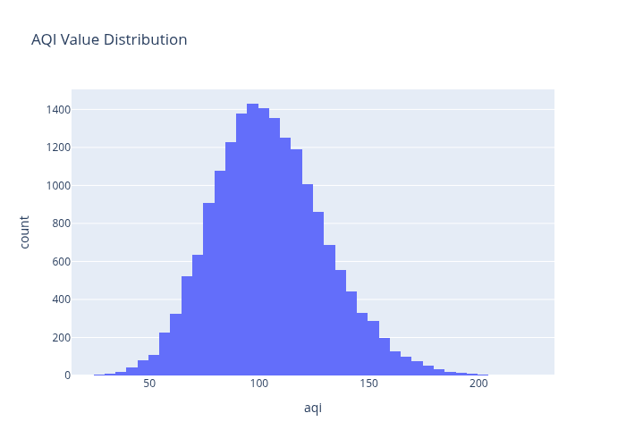
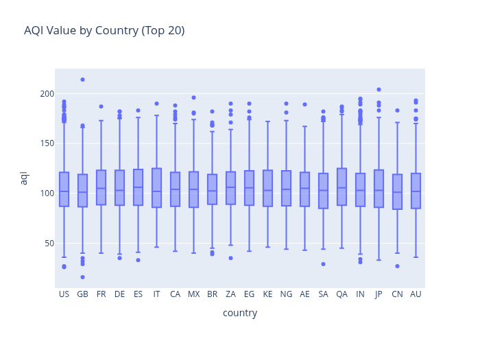
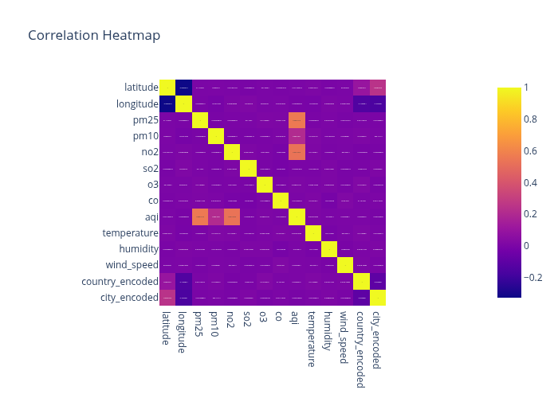
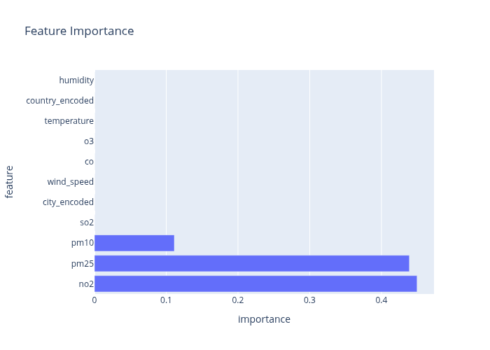

# Day 26: Extensive EDA with Plotly and ML on Global Air Quality Dataset

## Dataset

Global air quality dataset containing AQI values, pollutant levels, and location information from various cities worldwide.
[Kaggle](https://www.kaggle.com/datasets/smeet888/global-air-quality-data15-days-hourly-50-cities)

## Summary

Conducted comprehensive exploratory data analysis using interactive Plotly visualizations and built a Random Forest regression model to predict Air Quality Index (AQI) values based on pollutant measurements and location data.

## Key Analyses

**Data Overview**
- Dataset contains air quality measurements from cities worldwide
- Features include AQI values for various pollutants (PM2.5, NO2, O3, CO)
- Data includes location information (Country, City) and AQI categories

**Exploratory Data Analysis**
- AQI values show wide distribution with most cities having moderate air quality
- Significant variation in air quality across countries, with some regions showing consistently higher pollution levels
- Strong correlations between individual pollutant AQI values and overall AQI
- PM2.5 is a major contributor to overall air quality degradation

**Statistical Insights**
- Average AQI: ~70 (Moderate category)
- PM2.5 AQI ranges from 0 to 500+
- Countries with highest pollution levels include India, China, and several Middle Eastern nations
- AQI categories range from Good to Hazardous

## Machine Learning Model

**Random Forest Regression**
- Target: Overall AQI (continuous)
- Features: Pollutant levels (PM2.5, PM10, NO2, SO2, O3, CO), weather data (temperature, humidity, wind_speed), encoded location data
- Train/test split: 80/20
- Performance metrics:
  - MAE: 0.08
  - RMSE: 0.56
  - R²: 0.9995

**Model Performance**
- Excellent predictive accuracy with 99.95% variance explained
- PM2.5 is the strongest predictor of overall AQI
- Weather and location features provide additional predictive power
- Model effectively captures complex relationships between pollutants and air quality

## Insights

1. PM2.5 is the dominant pollutant affecting overall air quality
2. Geographic location significantly influences air quality patterns
3. Individual pollutant measurements strongly correlate with overall AQI
4. AQI categories provide useful stratification of air quality levels
5. Model can accurately predict AQI values for air quality monitoring
6. Pipeline enables easy deployment for real-time air quality prediction

## Example Usage

The notebook includes a scikit-learn Pipeline that combines preprocessing and the Random Forest model, allowing for straightforward AQI predictions on new air quality data. An example prediction is demonstrated with a sample location's pollutant measurements.

## Visualizations

- AQI value distribution histogram
- AQI value by country box plots (top 20 countries)
- Correlation heatmap of numeric features
- PM2.5 AQI vs Overall AQI scatter plot
- AQI category distribution pie chart
- Actual vs Predicted AQI scatter plot
- Feature importance bar chart

*Figure: Interactive visualizations from EDA and ML analysis*