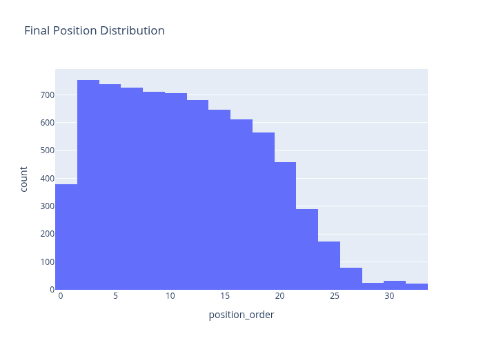
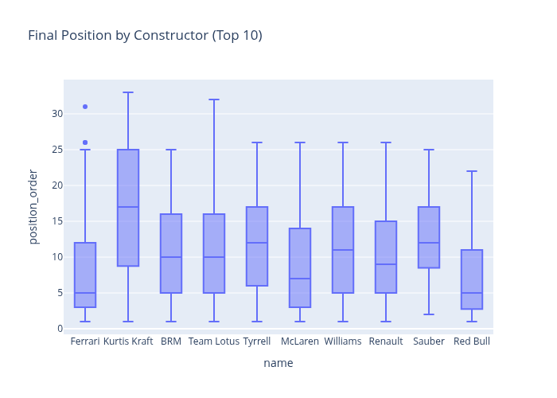
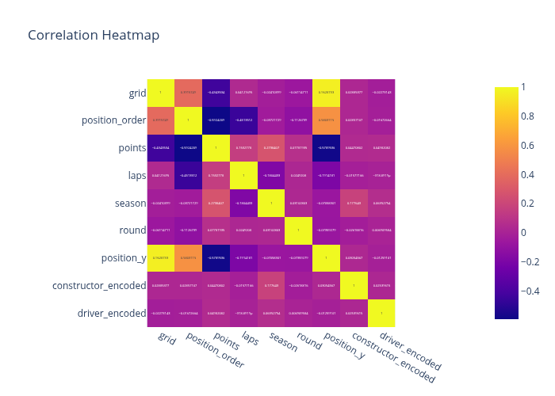
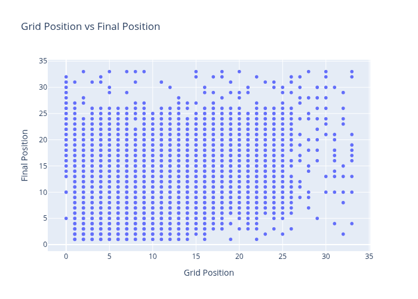
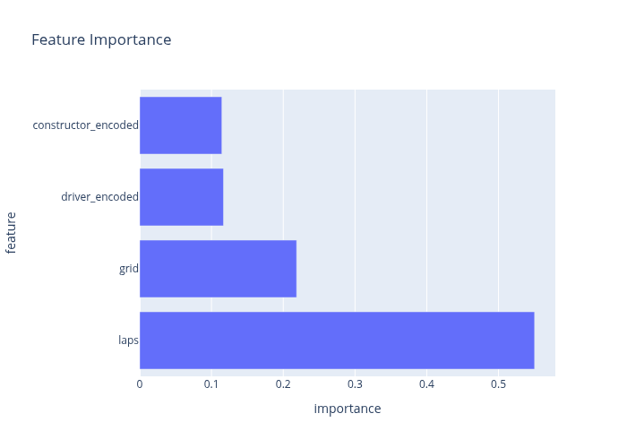

# Day 27: Extensive EDA with Plotly and ML on F1 Race Results Dataset

## Dataset

Formula 1 race results dataset containing comprehensive race data from 1950 to 2025, including driver performance, constructor information, qualifying results, and final race positions.
[Kaggle](https://www.kaggle.com/datasets/rockyt07/formula-1-championships-1950-2025)

## Summary

Conducted comprehensive exploratory data analysis using interactive Plotly visualizations and built a Random Forest regression model to predict final race positions based on grid position, constructor, driver, and race characteristics.

## Key Analyses

**Data Overview**
- Dataset spans over 70 years of F1 history from 1950 to 2025
- Merged data from multiple sources: results, races, drivers, constructors, qualifying
- Key metrics include grid positions, final positions, points scored, and laps completed

**Exploratory Data Analysis**
- Final position distribution shows most drivers finishing in midfield positions
- Significant variation in performance across different constructors
- Strong correlation between grid position and final race outcome
- Qualifying data available for more recent seasons, showing evolution of F1

**Statistical Insights**
- Average final position: ~11th place
- Grid position ranges from 0 (pit lane start) to 33
- Top constructors show consistent podium finishes
- Race distance varies significantly across different circuits

## Machine Learning Model

**Random Forest Regression**
- Target: Final race position (continuous)
- Features: Grid position, constructor (encoded), driver (encoded), laps completed
- Train/test split: 80/20
- Performance metrics:
  - MAE: 3.07
  - RMSE: 4.14
  - R²: 0.6353

**Model Performance**
- Good predictive accuracy with 63.5% variance explained
- Grid position is the strongest predictor of final race outcome
- Constructor performance provides additional predictive power
- Driver skill and experience captured through encoding

## Insights

1. Starting position is the most critical factor in determining race outcome
2. Constructor performance significantly influences individual driver results
3. Historical trends show evolution of F1 technology and competition
4. Qualifying performance strongly correlates with race results
5. Model can predict race positions with reasonable accuracy
6. Pipeline enables analysis of hypothetical race scenarios

## Example Usage

The notebook includes a scikit-learn Pipeline that combines preprocessing and the Random Forest model, allowing for straightforward race position predictions on new F1 data. An example prediction demonstrates usage with a sample driver's race data.

## Visualizations

- Final position distribution histogram
- Final position by constructor box plots (top 10 constructors)
- Correlation heatmap of numeric features
- Grid position vs final position scatter plot
- Actual vs predicted position scatter plot
- Feature importance bar chart

*Figure: Interactive visualizations from F1 race results analysis*