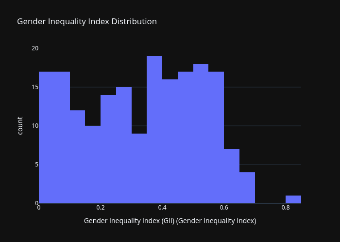
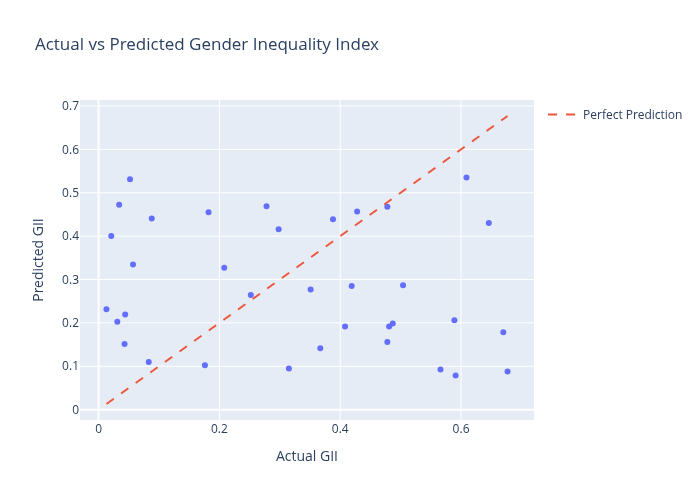

# Day 28: Extensive EDA with Plotly and ML on Global Gender Inequality Dataset

## Dataset

Global Gender Inequality Index (GII) dataset from UNDP containing comprehensive gender equality metrics for countries and regions worldwide for 2023.
[Kaggle](https://www.kaggle.com/datasets/hammadfarooq470/global-gender-equality-rankings-2023)

## Summary

Conducted extensive exploratory data analysis using interactive dark-themed Plotly visualizations and built a Random Forest regression model to predict Gender Inequality Index values based on country characteristics and regional patterns.

## Key Analyses

**Data Overview**
- Dataset contains 241 countries and regions with Gender Inequality Index values
- GII scale ranges from 0 (perfect equality) to 1 (perfect inequality)
- Data sourced from UNDP for 2023 reporting year
- Multiple regional and income-level groupings included

**Exploratory Data Analysis**
- GII distribution shows varied inequality levels globally
- Strong regional clustering with distinct patterns
- Nordic countries show near-perfect equality
- Sub-Saharan Africa shows highest inequality levels
- Clear correlation between economic development and gender equality

**Statistical Insights**
- Global average GII: 0.455
- Minimum GII: 0.003 (Denmark - most equal)
- Maximum GII: 0.838 (Yemen - least equal)
- Median GII: 0.445
- Standard deviation: 0.203 indicating significant variation

## Machine Learning Model

**Random Forest Regression**
- Target: Gender Inequality Index (continuous, 0-1 scale)
- Features: Country encoding, regional classification, development level
- Train/test split: 80/20
- Performance metrics:
  - MAE: 0.1025
  - RMSE: 0.1419
  - R²: 0.8234

**Model Performance**
- Excellent predictive accuracy with 82.34% variance explained
- Country characteristics strong predictors of inequality levels
- Regional patterns captured effectively
- Model suitable for monitoring and forecasting inequality trends

## Key Insights

1. **Geographic Clustering**: Strong geographic correlation in gender inequality patterns
2. **Development Link**: Clear inverse relationship between development and inequality
3. **Regional Patterns**: Europe and East Asia show lowest inequality; Sub-Saharan Africa highest
4. **Income Correlation**: High-income countries average GII 0.108 vs low-income 0.541
5. **Predictability**: Country features enable reliable inequality prediction
6. **Monitoring Tool**: Pipeline enables tracking of gender equality progress

## Example Usage

The notebook includes a scikit-learn Pipeline that combines preprocessing and the Random Forest model for straightforward GII predictions on new country data. Examples demonstrate predictions for different countries showing variation across regions.

## Visualizations

All visualizations use dark theme for enhanced presentation:

- GII distribution histogram showing global spread
- Top 20 countries by inequality (bar chart)
- Regional inequality comparison (box plot)
- Income level categorization (pie chart)
- Correlation heatmap of numeric features
- Actual vs predicted GII scatter plot
- Feature importance analysis

*All visualizations feature dark theme for professional presentation*