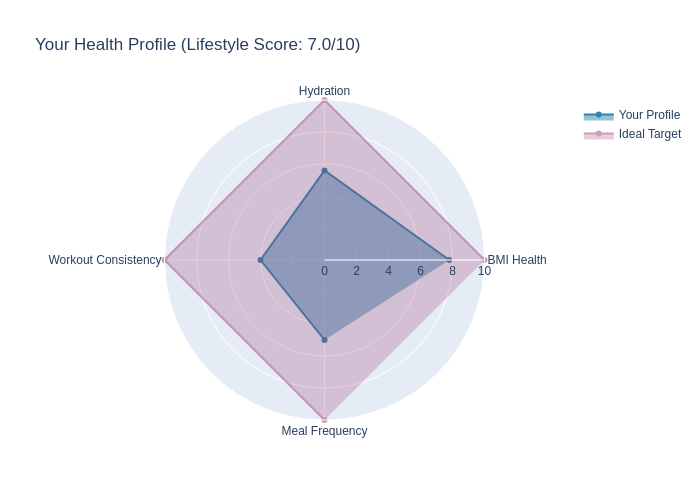

# Day 3: Health and Lifestyle Recommendation System

## Dataset

Kaggle - https://www.kaggle.com/datasets/jockeroika/life-style-data?select=Final_data.csv

## Summary

Built a health recommendation system with two components:
- Rule-based recommender that provides immediate, explainable advice based on BMI, hydration, exercise, and meal frequency
- ML-based recommender that predicts a healthy lifestyle label using a Random Forest classifier and offers targeted suggestions based on feature importance

## Key Visualizations

- Correlation heatmap of numeric health metrics
- Radar chart comparing user profile to ideal targets
- Feature importance bar chart from the Random Forest model
- Scatter matrix showing relationships between BMI, fat percentage, workout frequency, and water intake
- Comparison bar chart showing rule-based score vs ML-based score

_Profile visualization_

## Insights

- BMI and fat percentage strongly influence model predictions
- Workout frequency and hydration are actionable areas to improve
- The ML model highlights which numeric features contribute most to healthy lifestyle classification

## Files

- `notebooks/rcs.ipynb` - Notebook with rule-based system, ML pipeline, correlation analysis, and visualizations
- `data/Final_data.csv` - Main dataset used for modeling
- `data/meal_metadata.csv` - Supplementary meal metadata

## How to use

1. Open `notebooks/rcs.ipynb` and run cells top to bottom
2. Replace the dataset link above with your data source if needed

