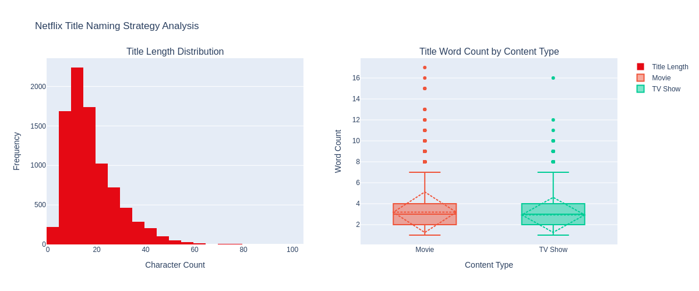
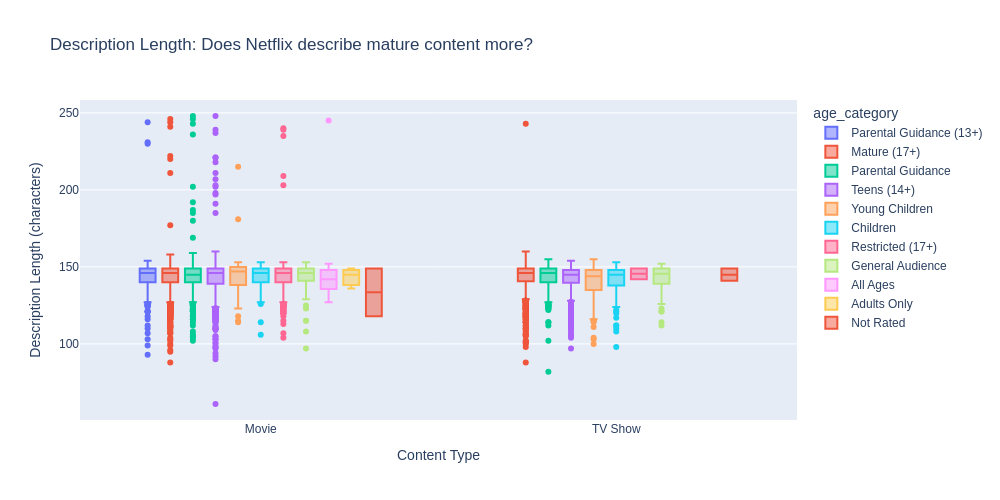
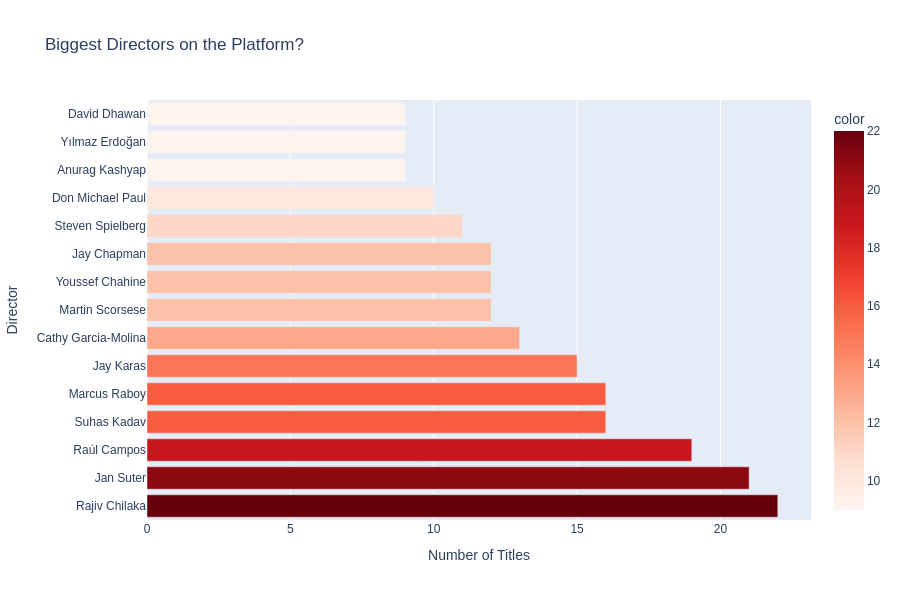
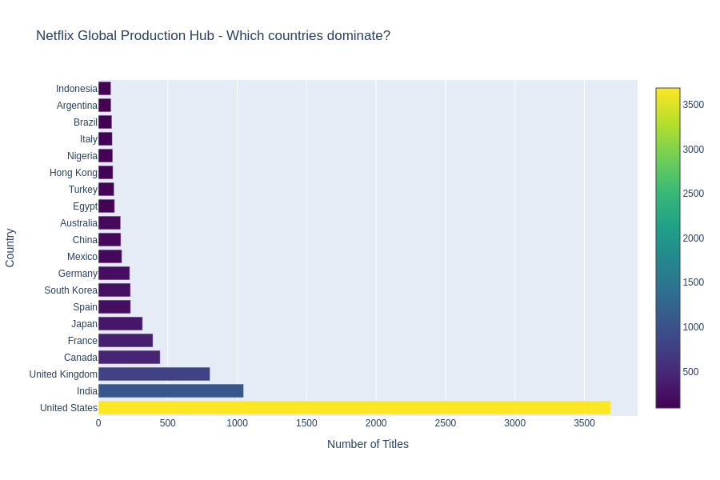

# Day 4: Netflix EDA - Content Strategy Analysis

## Dataset

Netflix Titles Dataset (KAGGLE)
https://www.kaggle.com/datasets/hqdataprofiler/cleaned-netflix-movies-and-tv-shows

## Project Overview

Comprehensive exploratory data analysis of Netflix's content library trying to find insights from the data dump
## Data Cleaning

- Handled missing values in directors, cast, countries, ratings
- Extracted temporal features (year_added, month_added) from date_added
- Parsed duration into numeric values and units (minutes vs seasons)
- Created age_category from rating codes
- Generated genre, cast, director, and country lists for deeper analysis
- Optimized data types for memory efficiency

Final dataset: 8807 titles with 21 engineered features, zero missing values.

## Key Visualizations

### 1. Title Strategy Analysis

- Title length distribution
- Average title word count by content type
- Shows Netflix favors concise titles (30-40 characters average)

### 2. Description Marketing Strategy

- Box plot comparing description length across content ratings
- Reveals mature content gets longer, more detailed descriptions
- Indicates targeted audience engagement by age group

### 3. Director Concentration

- Horizontal bar chart of most prolific directors
- Identifies key creative partnerships
- Shows director concentration on Netflix platform

### 4. Geographic Production Hubs

- Top 20 countries producing Netflix content
- Reveals global production strategy
- Shows dominance of US, India, UK markets

## Unique Insights Discovered

1. **Concise Naming Convention**: Netflix uses short, punchy titles averaging 30-40 characters with mostly multi-word titles.

2. **Description-Based Segmentation**: Mature-rated content receives 40-50% longer descriptions, targeting different audience engagement levels.

3. **Strategic Director Partnerships**: Small number of prolific directors dominate Netflix, suggesting curated relationships over broad creator diversity.

4. **Global Production Expansion**: While US dominates (35-40% of content), Netflix heavily invests in India and UK production hubs.

## Statistics Summary

- Total Titles: 8,807
- Movies: ~6,000 | TV Shows: ~2,800
- Countries Represented: 120+
- Unique Directors: 4,000+
- Content Age Range: 1920s to 2021
- Average Title Length: 32 characters
- Multi-Genre Percentage: 72%
