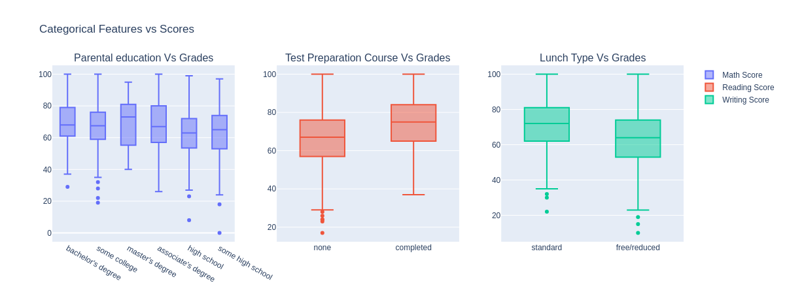

# Day 6 — Student Data Analysis & Multi‑Output Score Predictor

## Dataset
Students Academic Performance Dataset  
Source: https://www.kaggle.com/datasets/sadiajavedd/students-academic-performance-dataset

## Project summary
Predict three student exam scores (Math, Reading, Writing) simultaneously from demographic and preparatory features. The pipeline performs preprocessing (one‑hot encoding for categorical features) and fits a multi‑output regression model.

## Key EDA findings
- Gender: males tended to score higher on Math; females tended to score higher on Reading and Writing.  
- Test preparation: completing the test preparation course correlates with substantially higher scores.  
- Lunch: students with standard lunch showed higher average scores than those with free/reduced lunch.  
- Race/Ethnicity: Group E had the highest average performance across subjects.

## Model & implementation
- Goal: multi‑output regression to predict [Math, Reading, Writing].  
- Pipeline: OneHotEncoder for categorical features → RandomForestRegressor (multi‑output).  
- Artifact: trained pipeline saved as `students_performance_model.joblib`.

## Performance
- Initial model performance was low; R² scores near zero for some targets (example: ~0.15 for Writing), indicating the available features alone are weak predictors of individual scores.

## Next steps
- Feature engineering (interaction terms, aggregate features).  
- Try stronger learners (XGBoost, LightGBM) and ensembling.  
- Hyperparameter tuning with cross‑validation.  
- Add external or temporal features if available and evaluate fairness across subgroups.

## How to reproduce
1. Place the dataset in the project directory.  
2. Run the data preprocessing and training script (e.g., `python train.py`).  
3. The trained pipeline will be output as `students_performance_model.joblib`.