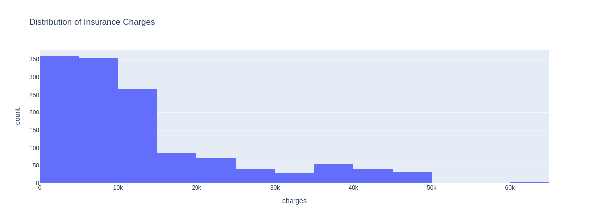
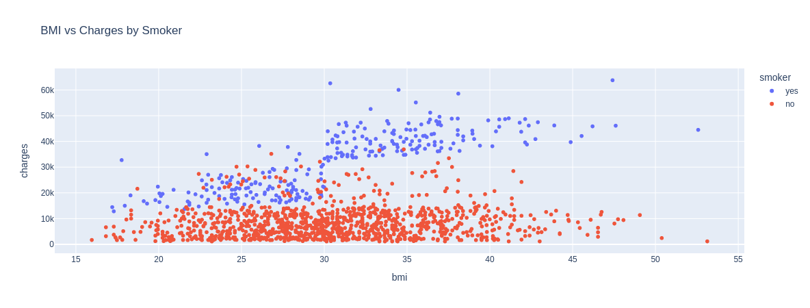

# Day 7: Decoding Medical Costs: Analyzing Insurance Data


## Dataset
Health Costs Insights: Insurance Data
Source: https://www.kaggle.com/datasets/saadaliyaseen/decoding-medical-costs-analyzing-insurance-data

## Overview
This project analyzes an insurance dataset and builds a model to predict insurance charges based on demographic and health-related features such as age, sex, BMI, number of children, smoking status, and region.

## Dataset
- File: `insurance.csv`
- Features: `age`, `sex`, `bmi`, `children`, `smoker`, `region`, `charges`
- Goal: Predict the `charges` column (continuous target)

## Visualizations



## Features & Preprocessing
- Categorical variables (`sex`, `smoker`) encoded using `LabelEncoder`
- `region` encoded using one-hot encoding
- Numeric features used directly
- Train/test split: 80/20

## Model
- Algorithm: `DecisionTreeRegressor`
- Parameters: `max_depth=4`, `min_samples_split=5`
- Evaluation metrics: MAE, MSE, R²

## Results
- Mean Absolute Error: ~2994
- Mean Squared Error: ~26,394,624
- R² Score: ~0.85

## Usage
1. Install dependencies:
```python
pip install pandas numpy scikit-learn plotly joblib
```
Run the notebook insurance_analysis.ipynb to explore, train, and predict.<br>
Use the provided predict_insurance_charges function to make new predictions.