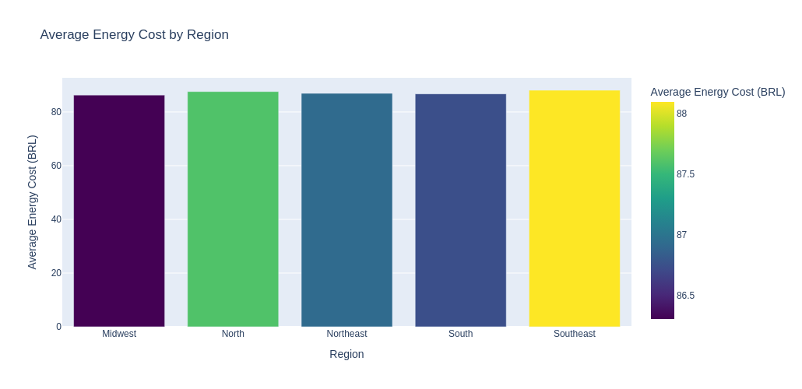
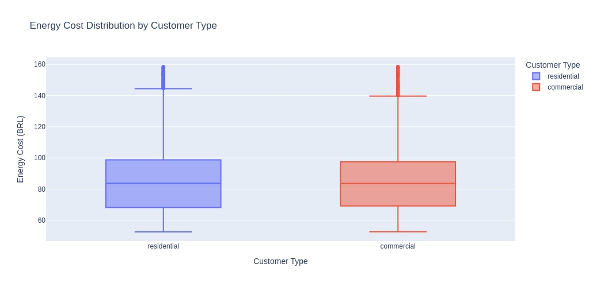

# Day 8: Energy Consumption & Cost Prediction

## Dataset
Kaggle: 
[Energy Consumption Dataset](https://www.kaggle.com/datasets/andreylss/residential-and-commercial-energy-cost-dataset)

## Project Summary

Built a predictive model to forecast energy costs based on customer characteristics. Decision Tree Regressor achieved test R2 score of 0.87 with mean absolute error of BRL 8-10.

## Key Findings

- **Building Size & Occupants**: Strongest predictors of energy cost
- **Cost Variation**: BRL 52-154 range (residential avg BRL 82, commercial avg BRL 85)
- **Regional Impact**: Different regions show distinct consumption patterns
- **Model Accuracy**: Test R2 0.87, RMSE BRL 11.32

## Visualizations

- Energy cost distribution by customer type and region
- Building size vs cost correlation
- Feature importance ranking
- Actual vs predicted cost scatter plot
- Residual analysis

## Model Performance

- Algorithm: Decision Tree Regressor (max_depth=10)
- Test R2 Score: 0.87
- Test MAE: BRL 8.95
- Test RMSE: BRL 11.32

## Files

- `notebooks/edaml.ipynb` - Complete EDA and modeling pipeline
- `data/energy_consumption.csv` - Raw dataset
- `models/energy_cost_model.joblib` - Trained model
- `models/customer_type_encoder.joblib` - Customer type encoder
- `models/region_encoder.joblib` - Region encoder
